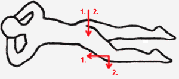
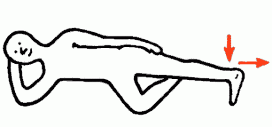
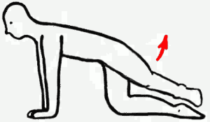
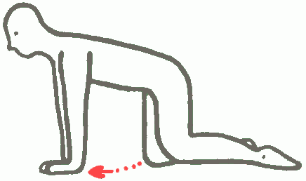
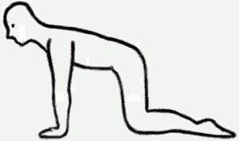
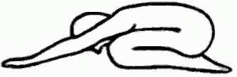
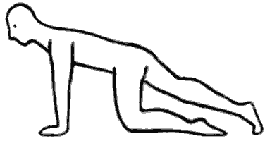
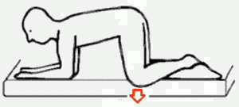

# Cvičenie na chrbticu

## SI

### 1. Na břiše 

Leh na břiše, ruce složené pod čelem. Začneme přitaho­vat levou nohu do plazení, ale přitom si hlídáme levý bok. V okamžiku, kdy máme pocit, že se levý bok začíná odlepo­vat od podložky, zastavíme pohyb levou nohou. V této pozici je výdrž s tlakem boků a levého kolena do podložky. Pak povolíme a provedeme na druhou stranu.

### 2. Na boku 

Leh na pravém boku. Pravou ruku dáme pod hlavu, pravou nohu skrčíme v koleni, máme levou v koleni nataženou, v kotníku děláme „fajku“. Levou nohu zatlačíme vnitřním kotníkem do podložky a vytáh­neme do dálky. Výdrž. Totéž na druhém boku.

### 3. Pejsek 

Vzpor klečmo, zvedneme střídavě pokrčenou pravou a levou nohu do boku (na pejska). Boky při tom zpevníme a nepřetáčíme. Důležité je hlídat si, že kole­no zdvižené nohy musí být minimálně(!) tak vysoko, jako její kotník. Účinnost cviku závisí na uvedených podmínkách nikoli jen na tom, jak vysoko je kotník.

### 4. Sunutí kolena 

Vzpor klečmo, naznačíme sunutí pravého kolena po podložce směrem k levé ruce. Pánev s držíme pevně na místě. Po chvíli výdrže se vrátíme zpět a zopakujeme na druhou stranu.

### 5. Zanožení 

Vzpor klečmo, pak sed na patách, protáhneme ruce dopředu, pak se přesuneme do vzporu a zároveň zanožíme jednu nohu. Nepřetáčíme pánev, boky jsou pevné. Posadíme se zpět na paty, pak nahoru do vzporu a zopakujeme totéž pro druhou nohu.

### 6. Na kraji lehátka 

Vzpor klečmo na kraji lehátka, pokrčíme lokty a opřeme se o před­loktí), vnitřní noha je u kraje lehátka, vnější visí mimo lehátko a je zavěšená nártem a lýtko druhé nohy. Provádíme mírný tah volně visícího kolene nahoru dolů, max.2cm pod okraj lehátka (noha je stále ve svislé poloze). Lokty a kolena svírají s lehátkem pravý úhel, nesedáme si na paty, nepřetáčíme tělo. Pak totéž na druhou stranu.

Více se dočtete na slunecnyzivot.cz/2013/02/cviky-k-posileni-si-skloubeni/ © Slunečný život
